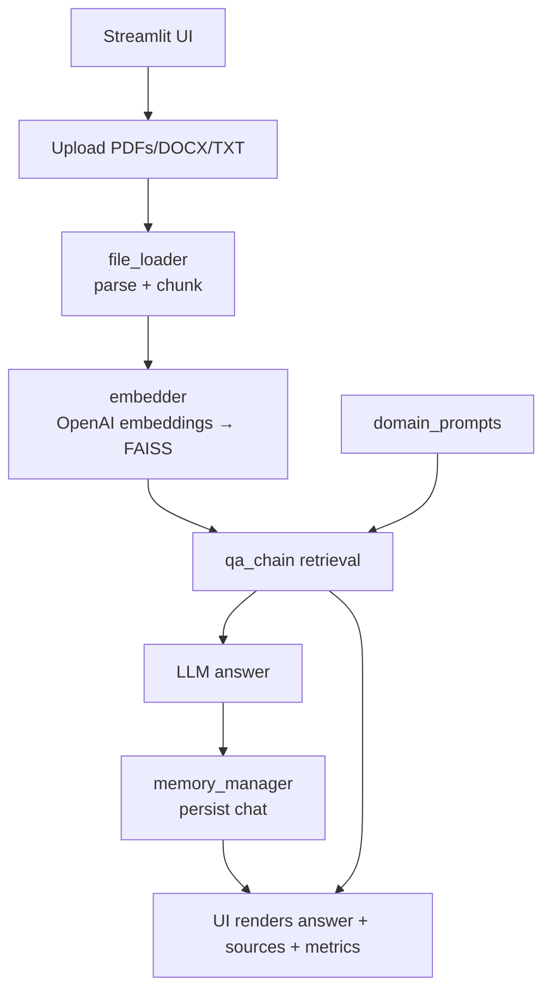

# BrainDoc AI — Document Intelligence

BrainDoc AI is a Streamlit RAG app. Upload PDFs/DOCX/TXT, pick a domain (Healthcare, Legal, Finance, Education), and get contextual answers with source citations. Safety checks block risky queries; chat history is saved between turns.

## 🚀 Features

| Feature                   | Description                                                       |
|---------------------------|-------------------------------------------------------------------|
| 🔍 Domain Selection       | Healthcare, Legal, Finance, or Education                          |
| 📄 Multi-file Upload      | Upload one or more PDFs, Word Docs, or TXT files                  |
| 💬 Contextual Q&A        | Ask questions about document content with source snippets         |
| 🧠 Custom Prompting      | Domain-aware prompts for tailored answers                         |
| 💾 Chat Memory + History | Persists chat between turns; history shown in sidebar              |
| 📊 Session Metrics       | Documents uploaded, chunks indexed, and questions asked           |

## 🧭 How It Works
1) Upload & parse: `file_loader` saves temp files, reads, and chunks text (700 size, 100 overlap) with PDF fallbacks (PyPDF → PDFPlumber → PyMuPDF).
2) Embed & index: `embedder` builds a FAISS vector store using OpenAI embeddings.
3) Retrieval-augmented Q&A: `qa_chain` retrieves relevant chunks and queries the LLM with the domain prompt + user question.
4) Safety: `app.py` blocks overly long or suspect questions before the model call.
5) Memory: `memory_manager` trims/saves chat history so answers stay concise.

## 🧩 Architecture




## 📁 Folder Structure

```
BrainDoc/
├── app.py
├── requirements.txt
├── .env
├── .env.example
├── .gitignore
├── chat_history.pkl
├── data/                       # 📄 Sample documents
│   ├── healthcare_sample.txt
│   ├── finance_example.txt
│   ├── legal_contract.txt
│   └── course_outline.txt
│
├── modules/
│   ├── file_loader.py
│   ├── embedder.py
│   ├── qa_chain.py
│   ├── memory_manager.py
│   └── domain_prompts.py
├── samples/                        # 📋 Domain-specific test documents
│   ├── COURSE_SYLLABUS.txt         (Education)
│   ├── SOFTWARE_LICENSE_AGREEMENT.txt  (Legal)
│   ├── MEDICAL_REPORT.txt          (Healthcare)
│   └── FINANCIAL_REPORT.txt        (Finance)
├── tests/
│   └── test_smoke.py
```

---

## 🧪 Quick Test with Sample Documents
Upload any file from the `samples/` folder to test each domain:

| Domain | Document | Try Asking |
|--------|----------|------------|
| 🏥 Healthcare | `MEDICAL_REPORT.txt` | "What are the critical health risks identified?" |
| ⚖️ Legal | `SOFTWARE_LICENSE_AGREEMENT.txt` | "What are the restrictions on the licensee?" |
| 💼 Finance | `FINANCIAL_REPORT.txt` | "What were the major revenue sources?" |
| 🎓 Education | `COURSE_SYLLABUS.txt` | "What are the course objectives?" |

---

## ⚙️ Setup Instructions

1. **Clone the repository**
```bash
git clone https://github.com/yourusername/braindoc.git
cd BrainDoc
```

2. **Install dependencies**
```bash
pip install -r requirements.txt
```

3. **Create your `.env` from the example**
```
# Windows (PowerShell)
Copy-Item .env.example .env

# macOS/Linux
cp .env.example .env
```
Open `.env` and set your key:
```
OPENAI_API_KEY=your_openai_key_here
```

4. **Run the app**
```bash
streamlit run app.py
```
5. **Run tests locally**
```bash
pytest -q
```

## 📜 License
MIT

---

