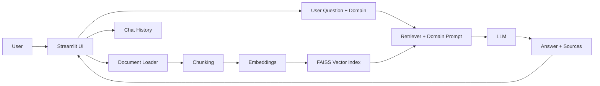

# BrainDoc AI

BrainDoc AI is a domain-aware document intelligence app built with Streamlit and Retrieval-Augmented Generation (RAG). It helps users upload documents, ask focused questions, and get grounded answers with source context.

Supported domains:
- Healthcare
- Legal
- Finance
- Education

## Features

- Multi-file upload (`.pdf`, `.docx`, `.txt`)
- Domain-specific prompting for better relevance
- Safety guardrails for risky/sensitive queries
- Retrieval-backed answers with source snippets
- Session chat history and sidebar metrics
- Graceful handling of partially failed document parsing/embedding

## Architecture (Simple View)



## How It Works

1. Upload one or more documents from the UI.
2. Files are parsed and split into chunks.
3. Chunks are embedded and stored in a FAISS index.
4. A user question is validated by safety checks.
5. The retriever pulls relevant chunks.
6. The model answers using both retrieved context and selected domain behavior.
7. The app shows the answer, sources, and saves the turn in chat history.

## Project Structure

```text
BrainDoc/
├── app.py
├── requirements.txt
├── .env.example
├── modules/
│   ├── file_loader.py
│   ├── embedder.py
│   ├── qa_chain.py
│   ├── memory_manager.py
│   └── domain_prompts.py
├── samples/
│   ├── COURSE_SYLLABUS.txt
│   ├── SOFTWARE_LICENSE_AGREEMENT.txt
│   ├── MEDICAL_REPORT.txt
│   ├── FINANCIAL_REPORT.txt
│   ├── course_outline.txt
│   ├── finance_example.txt
│   ├── healthcare_sample.txt
│   ├── legal_contract.txt
│   └── blank.pdf
└── tests/
	└── test_smoke.py
```

All demo/test documents are consolidated in `samples/`.

## Quick Start

1. Clone repository

```bash
git clone https://github.com/yourusername/braindoc.git
cd BrainDoc
```

2. Install dependencies

```bash
pip install -r requirements.txt
```

3. Configure environment

```bash
# Windows (PowerShell)
Copy-Item .env.example .env

# macOS/Linux
cp .env.example .env
```

Set your API key in `.env`:

```env
OPENAI_API_KEY=your_openai_key_here
```

4. Run app

```bash
streamlit run app.py
```

5. Run tests

```bash
pytest -q
```

## Sample Test Prompts

| Domain | Sample File | Example Question |
|---|---|---|
| Healthcare | `MEDICAL_REPORT.txt` | What are the critical health risks? |
| Legal | `SOFTWARE_LICENSE_AGREEMENT.txt` | What restrictions apply to the licensee? |
| Finance | `FINANCIAL_REPORT.txt` | What are the major revenue drivers? |
| Education | `COURSE_SYLLABUS.txt` | What are the course objectives and grading policy? |

## 📜 License

MIT

